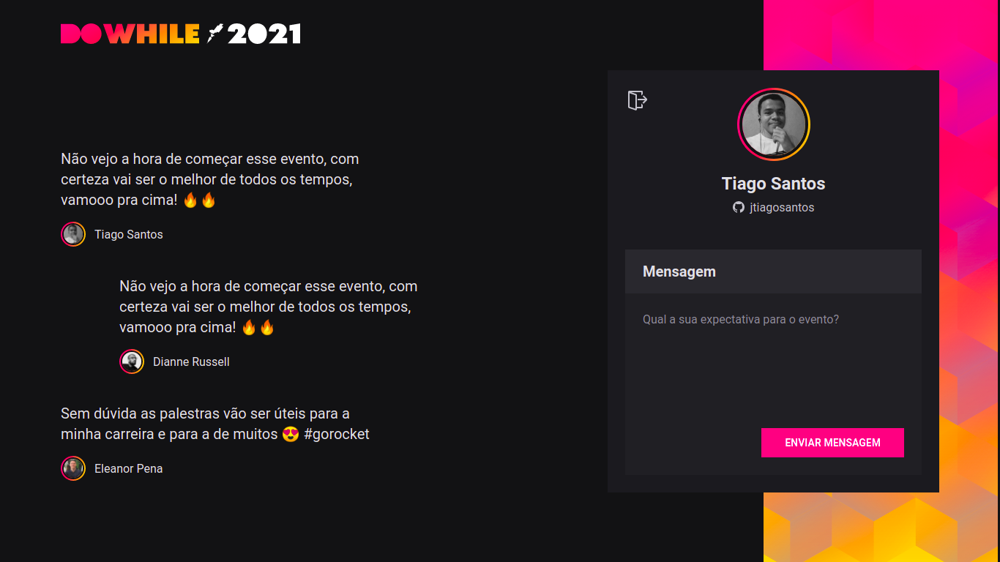
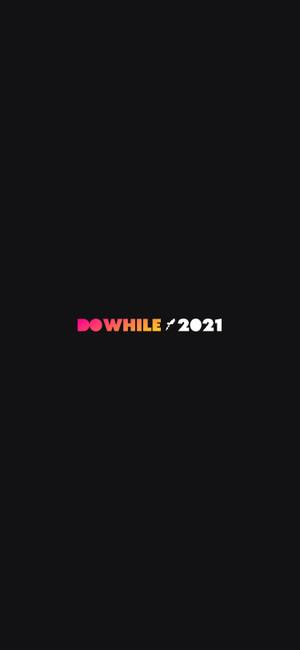
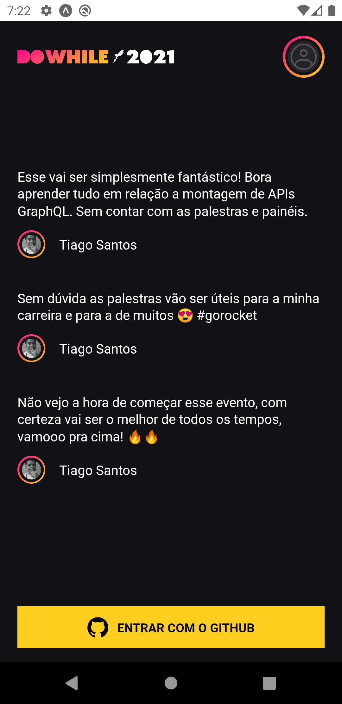
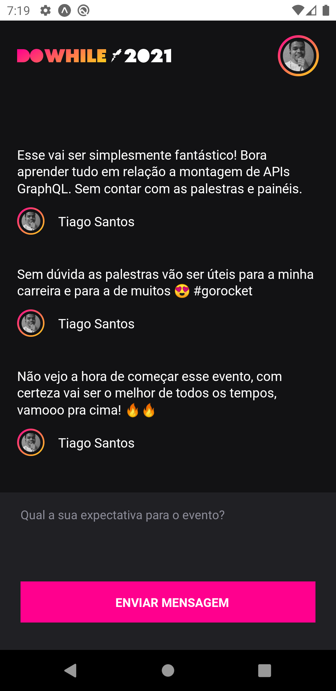
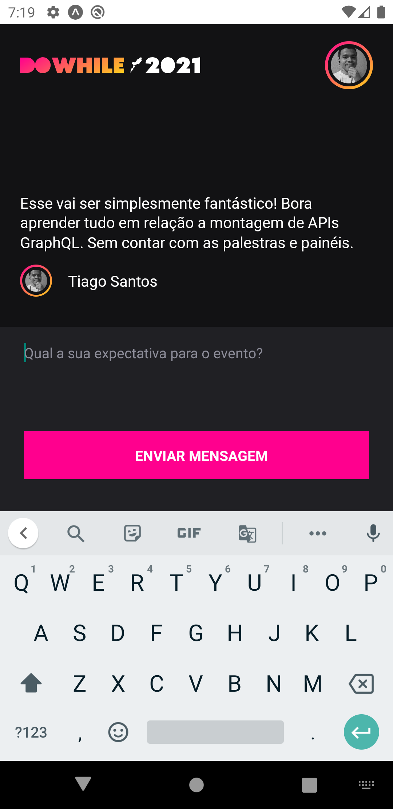

## :computer: Web

<h1 align="center">
    
</h1>

## :iphone: Mobile

  
    
  
  
    
  
  
    
  
  
    
  

## :memo: Project

FullStack project of the system that will be used at Rocketseat's DoWhile 2021 event. #NLWHeat

## :computer: Technologies used

:zap: Front-end

:pushpin: React

:pushpin: Vite

:pushpin: Typescript

:pushpin: Sass Modules

:pushpin: Socket.io-client

:pushpin: Axios

 

:zap: Back-end

:pushpin: Node.js

:pushpin: Express

:pushpin: Typescript

:pushpin: Prisma

:pushpin: Ts-node-dev

:pushpin: Axios

:pushpin: Socket.io

:pushpin: Github OAuth

 

:zap: Mobile

:pushpin: Expo

:pushpin: Typescript

:pushpin: Moti

:pushpin: Axios

:pushpin: Socket.io-client

 

:zap: Database

:pushpin: SQLite

## 🔖 Layout

You can view the project layout through the link below:

- [Layout Web & Mobile](https://www.figma.com/file/lE3GqMd521l3wJUspcV89n/%5BNLW-Heat---Mission%3A-Impulse%5D-DoWhile2021-(Community)?node-id=0%3A1) 

:man_technologist: Made with :heart: by Tiago Santos.
